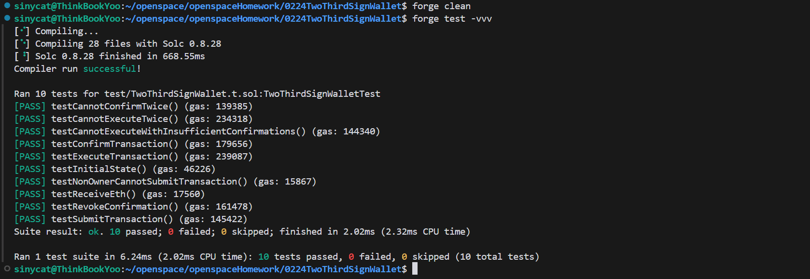

# TwoThirdSignWallet 多签钱包

## 内容概述

TwoThirdSignWallet 是一个基于以太坊的 2/3 多签钱包智能合约，需要三个所有者中的至少两个同意才能执行交易。该合约基于 OpenZeppelin 库构建，提供了安全可靠的多方资金管理解决方案。

## 合约特点

- **2/3 多签机制**：需要 3 个所有者中的至少 2 个确认才能执行交易
- **安全保障**：使用 OpenZeppelin 的 ReentrancyGuard 防止重入攻击
- **完整事件记录**：所有操作都有对应的事件记录，便于链下监控
- **灵活交易管理**：支持提交、确认、撤销确认和执行交易
- **支持任意调用**：可以执行简单转账或复杂的合约调用

## 采用技术

合约基于以下 OpenZeppelin 库构建：

- `ECDSA`：用于签名验证
- `MessageHashUtils`：用于消息哈希处理
- `ReentrancyGuard`：防止重入攻击

## 主要功能

1. **提交交易**：任何所有者可以提交交易请求
2. **确认交易**：所有者可以确认待执行的交易
3. **执行交易**：当确认数达到阈值后，交易可以被执行
4. **撤销确认**：所有者可以在交易执行前撤销自己的确认
5. **查询功能**：提供多种查询方法，获取交易和确认状态

## 使用方法

### 部署合约

部署合约时需要提供三个不同的所有者地址：
```solidity
address[3] memory owners = [owner1Address, owner2Address, owner3Address];
TwoThirdSignWallet wallet = new TwoThirdSignWallet(owners);
```
### 向钱包转入资金

直接向合约地址转账即可：
```solidity
// 使用 send 或 transfer
address(wallet).transfer(amount);
// 或使用 call
(bool success, ) = address(wallet).call{value: amount}("");
require(success, "转账失败");
```
### 提交交易

所有者可以提交交易请求：
```solidity
// 简单转账
uint256 txIndex = wallet.submitTransaction(receiverAddress, amountInWei, "");
// 调用其他合约
bytes memory data = abi.encodeWithSignature("functionName(uint256)", parameter);
uint256 txIndex = wallet.submitTransaction(contractAddress, 0, data);
```
### 确认交易

其他所有者确认交易：
```solidity
wallet.confirmTransaction(txIndex);
```
### 执行交易

当至少有两个所有者确认后，任何所有者可以执行交易：
```solidity
wallet.executeTransaction(txIndex);
```
### 撤销确认

所有者可以在交易执行前撤销自己的确认：
```solidity
wallet.revokeConfirmation(txIndex);
```
### 查询功能
```solidity
// 获取所有者
address[3] memory owners = wallet.getOwners();
// 获取交易数量
uint256 count = wallet.getTransactionCount();
// 获取交易详情
(address to, uint256 value, bytes memory data, bool executed, uint256 numConfirmations) = wallet.getTransaction(txIndex);
// 检查是否已确认
bool isConfirmed = wallet.isConfirmed(txIndex, ownerAddress);
```
## 安全考虑

- 合约使用 ReentrancyGuard 防止重入攻击
- 所有关键操作都有权限检查
- 交易执行状态严格管理，防止重复执行
- 确认机制确保多方共识

## 测试

使用 Foundry 框架编写。测试覆盖了所有主要功能和边界情况：
```bash
forge test -vvv
```
## 测试成功截图

