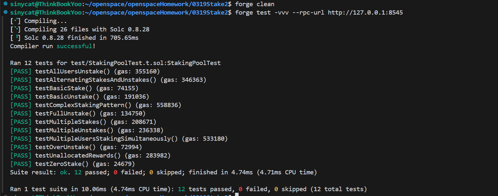

## 主要内容

### 1. 编写部署 KKToken(ERC20)合约 增加一个setStakingPool(address _stakingPool)方法.

### 2. 编写部署 StakingPool 合约,在构造函数传入KKToken的地址

### 3. StakingPool合约包含 stake,unstake,claim,_updatePool等方法.且在各方法执行时,都先执行_updatePool方法,保证每个user进入时候都更新accumulatedRewardPerShare这个最重要的衡量总收益的增量变量.

### 4. 编写测试合约,对多种情况进行测试.

## 测试结果截图

